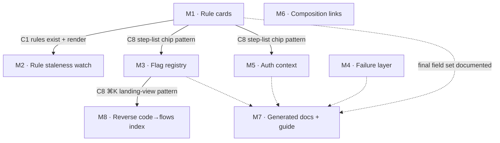

# Flow Expressiveness — MVP Cut & Delivery Roadmap

## 1 · Summary

The Flow Expressiveness plan (five improvement axes for the flow documentation) survives its
adversarial evaluation **amended**: six intrinsic blockers resolved at the gate, five reality
holes scoped into the cut, two proposed axes promoted from the missing-axes lens, one axis (PII)
evaluated and deferred. The cut is **8 milestones**, each a vertical vehicle a developer can see
working — 6 passed the fragment panel on the first pass; the two rejected ones (rule cards
bundling four tiers; auth shipping 1/39 backfill) were re-cut into M1+M2 and M5 as below and
re-validated. Everything lands in the dependency-explorer monorepo; the key parallelism: M3, M4,
M5 touch disjoint schema fields, extractor branches, and report sections, so three tracks can
run simultaneously once their Zod contracts (10-line PRs) are agreed. Target app: the existing
React SPA + the `pnpm discover` CLI report — no Vue/React targeting decision applies.

## 2 · Grounding findings

Full detail in [grounding.md](grounding.md); the load-bearing facts:

| Finding | Consequence |
|---|---|
| `FlowCodeEdge.mode` already discriminates async edges; 🫀 checker + `pnpm discover` vs `pnpm check` split already embody the checker-split doctrine | The amendments' architecture is the codebase's existing architecture — low integration risk |
| DLQ facts hide in 3 shapes (raw RedrivePolicy, `createSqs({dlqToAppend})` args, `Fn::GetAtt` objects); the current parser stops at `destinations:` | M4's extractor is a real parser, not a regex extension |
| DLQ applicability: ~16 of 66 async edges; svc-requests notification queues are genuine `confirmed-missing` fixtures | M4 backfill is small and the waiver ships with real content on day one |
| Flag `kind` is call-site-determined, not name-derived; dev flags outnumber product 4:1; only 6 flows carry flag literals | M3 keeps `kind` authored; backfill is an afternoon |
| The overnight rule's real shape: backend source of truth + monolith engine + web client-side *mirror* + tablet offline guard | M1's schema carries `sourceOfTruth` + backend/monolith platform values |
| No hashing utility exists anywhere in packages/ | M2's hash stamp is new code (node:crypto), pattern-compatible with Provenance |
| `app/controllers/v3/api/` exists (140 files, 531 authorize/can_* hits); svc authorizer syntax varies; 21 svc-punch routes have NO authorizer | M5 extracts both syntaxes and represents `authAbsent` honestly |
| 13 cross-flow prose refs encode 3 distinct relationship kinds | M6's link carries a `kind`, not a flat id array |
| planning-actions-coverage.md is mostly NOT derivable; no doc diff gate exists today | M7 generates marked sections only; the gate is new and self-contained |
| 237/239 code units carry `path`; the dataset is fully client-resident at load | M8 is a pure derived index — zero authored data |

## 3 · Target-app decision

Single-surface product: every milestone targets `packages/schema` + `packages/data` +
`packages/discovery` (CLI report) + `packages/web` (React SPA). No migration dimension.

## 4 · Capabilities → workstreams → contracts

Workstreams per milestone are the four monorepo layers; one dev/pair can own a milestone
end-to-end. The parallelization seams are the Zod contracts:

| Contract | Shape | Producer → consumers |
|---|---|---|
| C1 rule model | `DomainRuleSchema { id, title, statement, sourceOfTruth?, divergences[{platform: backend\|monolith\|web\|mobile\|tablet, behavior, codeUnitRef?}], sourcePaths[] }` + `ruleRefs?` on steps/units | schema → data, web, discovery |
| C2 staleness stamp | `sourceHashes?: { path, sha256 }[]` on rules | data → discovery |
| C3 flag model | `FeatureFlagRefSchema { name, kind: product\|dev, scope? }` + `flags?` on units/edges; flag→flows registry derived at build | schema → data, web, discovery |
| C4 failure model | `failure?: { dlq?, retryPolicy?, onError?, dlqAbsent?: 'confirmed-missing' }` on async edges; `ServerlessFacts` gains DLQ/retry facts; 🧯 report section | schema → data, web, discovery |
| C5 auth model | `trigger?: { actor, role? }` on flows; `auth?: { tokenType (AuthTypeSchema), gate?, authAbsent? }` on edges; `DiscoveredEndpoint.authorizerName?` | schema → data, web, discovery |
| C6 flow link | `links?: [{ to: flowId, kind: continuation\|writes-back-to\|same-journey\|domain-related }]` (reverse derived) | schema → data, web |
| C7 doc markers | `<!-- GENERATED:BEGIN/END -->` sections + docs-gen diff gate in `pnpm check` | discovery → docs |
| C8 UI surface | UrlState params `rule`, `flag`, `file` + `SearchResultType` additions + step-list chip pattern | web-internal, consumed by M1/M3/M5/M8 |

## 5 · Dependency DAG

M4, M6 and M7's generator half have no upstream dependency — they can start day 1 in parallel
with M1. The C8 chip/landing patterns are established once (M1 for chips, M3 for ⌘K landing)
and copied after. M7's authoring-guide chapter is last (documents the final field set).

## 6 · Milestones

### M1 · Domain-rule cards — the punch knowledge becomes first-class
- **Goal/hypothesis:** the overnight/coupling domain knowledge stops rotting in prose; a developer reads it as structured, sourced data.
- **Vehicle:** "A developer opening badging-review reads the overnight day-attribution rule as a card — svc-punch named as source of truth, the web front's client-side mirror flagged as a reimplementation."
- **Capabilities:** rule registry · rule refs on steps/units · rule card UI.
- **Workstreams:** schema (C1) · data (rules.ts + flagship rules authored from the punch prose — a scoped editorial task, the prose exists in 3 flow files) · web (step-list rule chips → card panel with divergence table; no graph click handlers needed — the step list already renders).
- **Contracts produced:** C1; the C8 chip pattern.
- **Demo:** open badging-review → click the rule chip → read the card.
- **Ordering:** value ▸ punch-pain first, zero extractor risk, all in-repo.
- **Gate:** re-cut from the first-pass rejection (was bundling staleness + all tiers); re-validated ✅.

### M2 · Rule staleness watch — human meaning, machine-watched
- **Goal:** resolve blocker B6 in shipped code: narratives can't rot silently.
- **Vehicle:** "Touch day_update_service.rb upstream and the next `pnpm discover` flags the overnight rule for re-review, naming the changed file."
- **Workstreams:** data (C2 hash stamps) · discovery (new report section cloning 🫀 mechanics).
- **Contracts consumed:** C1, C2. **Demo:** terminal, two `pnpm discover` runs around a `touch`.
- **Ordering:** immediately behind M1 — it is M1's warranty.
- **Gate:** re-validated ✅.

### M3 · Feature-flag registry
- **Vehicle:** "⌘K FEATUREDEV_CANARY_CORRECT_OVERTIME → lands on the flows gated by it; a fabricated flag ref goes red in the discovery report."
- **Workstreams:** schema (C3) · data (6 flag-carrying flows migrated; `kind` authored — grounding killed name-derivation) · discovery (~25-line parametrization of the unreferenced-callee loop) · web (flag chips + ⌘K flag entity with `?flag=` landing view — the landing view is real new work, not just a type union entry).
- **Contracts produced:** C3; the C8 ⌘K landing pattern.
- **Ordering:** cheapest checker, establishes the ⌘K pattern M8 reuses. **Gate:** ✅ first pass.

### M4 · Failure & resilience layer
- **Vehicle:** "payslip-dispatch's SQS edge wears a DLQ shield; 🧯 lists svc-requests' notification queues as confirmed-missing — an org DLQ-standard audit for free."
- **Workstreams:** schema (C4, `idempotent` cut per B1) · discovery (three-shape parser: RedrivePolicy blocks, `createSqs` args, `Fn::GetAtt` objects; 🧯 section with waiver) · web (**first-ever edge-badge rendering in the code view** — the ⚑ precedent does not actually render; this milestone builds it) · data (backfill the ~16 service-targeted async edges; CDC edges excluded — different fault model).
- **Ordering:** retires the hardest extraction risk; independent of M1-M3, can start day 1.
- **Gate:** ✅ first pass.

### M5 · Auth & permission context
- **Vehicle:** "Every one of the 39 flows answers 'who can trigger this?'; punchclock-device-setup shows the manager-login → token-employee → shop-JWT chain as typed chips; a fabricated gate name goes red in the report."
- **Workstreams:** schema (C5, all optional) · discovery (authorizer capture in both syntaxes; gate-name checker) · data (**trigger backfilled on ALL 39 flows in-milestone** — one line each; edge-auth on the punch flows as flagship, then coverage grows domain-by-domain like CODEOWNERS adoption, with the report showing coverage) · web (token/gate chip line in the step list).
- **Note:** token-lifecycle facts (the deliberately-reusable stale tablet token) stay prose — recorded as a named boundary of the schema.
- **Ordering:** after the M1 chip pattern exists. **Gate:** re-cut from first-pass rejection (was 1/39 backfill); re-validated ✅.

### M6 · Flow composition links
- **Vehicle:** "From employee-clock-in, navigate to badging-review; from payroll-export to planning-report-export and back — the 13 prose cross-references become typed, kind-qualified links."
- **Workstreams:** schema (C6 with the `kind` enum — grounding showed three distinct relationship semantics; a flat id array would recreate the free-text-guards precision problem) · data (migrate the 13 refs; the leave-request-approval→shift-creation case authored as `writes-back-to`) · web (link chips in the flow modal + flow list).
- **Note:** no extractor exists for this axis — links are authored, checker-verified for id-existence only (integrity.test.ts one-liner). The KPI/salary-mass destination side is verified against svc-kpis/svc-events during backfill.
- **Gate:** ✅ first pass.

### M7 · Generated docs + authoring guide
- **Vehicle:** "Edit a flow file without regenerating docs → `pnpm check` fails. The '23 flows' staleness class is structurally dead; the authoring guide finally documents the code layer."
- **Workstreams:** discovery (docs-gen module rendering marked sections; shared `getFlowDomains` util extracted from FlowListModal) · CI (the diff gate — genuinely new, self-contained, no sibling repos) · docs (one-time hand-refresh of non-derivable tables; the code-layer chapter written LAST, covering C1/C3/C4/C5/C6 fields).
- **Scope honesty:** planning-actions-coverage.md's action taxonomy is not derivable — the generator owns counts/lists/attribution sections only.
- **Gate:** ✅ first pass.

### M8 · Reverse code→flows index
- **Vehicle:** "⌘K 'day_update_service' → badging-review; ⌘K 'ClockInOutManager' → the three punch flows — which documented flows cross the file I'm changing?"
- **Workstreams:** web only — tier a (append `unit.path` to flow-entry haystacks, ~1 line, ships immediately) then tier b (a `file` entity type with a landing view listing that file's flows, reusing the M3 landing pattern).
- **Gate:** ✅ first pass.

## 7 · Milestone stack

## 8 · Parallelization plan

- **Day 1:** M1 (rules) and M4 (failure) and M7's generator half start simultaneously — C1 and C4 touch disjoint schema surfaces; the docs generator only reads the dataset.
- **Day 1 also:** M6's schema+data work — C6 is independent of everything.
- **After M1 merges:** M2 (needs rules on disk) and M5 (copies the chip pattern) start in parallel.
- **After M3 merges:** M8 tier b (copies the landing-view pattern); M8 tier a can ship any time.
- **Critical path:** M1 → M2/M5 → M7's guide chapter (needs the final field set). Everything else is off-path.

## 9 · Out of scope / deferred / open questions

**Out of scope (cut, with reasons recorded in [spec-challenge.md](spec-challenge.md)):**
timing/SLA view (statically unverifiable) · observability links (Phase 4 read-only overlay) ·
test-coverage mapping (serves CI dashboards, not the map) · flag rollout state (runtime data) ·
`idempotent` on edges (B1: no extraction path) · flow-graph click handlers (cards open from the
step list; graph interactivity is its own future effort).

**Deferred — PII/data-sensitivity axis:** real but not committable yet. Grounding found the
name-heuristic density inverted vs. stakes (payroll/HRIS SDKs lowest hit density) and an
existing stronger source the plan missed: `@skelloapp/lib-anonymizer` decorators
(`@RandomAnonymizer(EMAIL|…)`) — machine-readable per-field PII typing, today only on 5
svc-punch-sdk models. Revisit as decorator-scan-first + name-heuristic review-assist once
decorator coverage grows; pairs naturally with the P2 contract-references axis.

**Deferred — P2 from the original plan:** contract references (Swagger operationId refs) ·
coverage expansion (9 remaining candidate flows + ~17 planning-action gaps) — unchanged,
deliberately after the schema lands.

**Open questions (owner: Ben):**
1. M6 backfill needs svc-kpis/svc-events read access to verify the punch fan-out's destination side — confirm those repos may be grounded.
2. M5: should edge-auth coverage become a tracked adoption metric in the report (like CODEOWNERS coverage on the ownership page)?
3. M2's hash stamps double as a generic mechanism — extend to flow codeUnits themselves later (flow-level "source changed since authoring" watch)? Out of this cut, worth an ADR.

**Spec-challenge holes carried as assumptions:** see [spec-challenge.md](spec-challenge.md) —
all six blockers resolved by amendment; the five reality majors are scoped into M3/M4 (parser
shapes, edge-badge rendering, landing views) and M1 (step-list chips instead of graph clicks).

## 10 · Handoff

Fold this cut into the original deliverable: author `docs/spec.md` (the amended five axes + the
two promoted ones, with the corrected facts from grounding.md) and `docs/features.md` ordered by
this roadmap's milestones, then open the PR — the plan's execution steps apply unchanged from
there, and M1 is ready to start the moment the spec merges.
